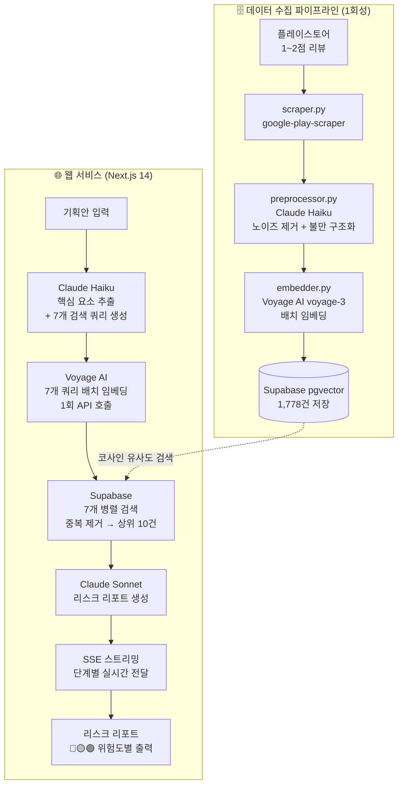
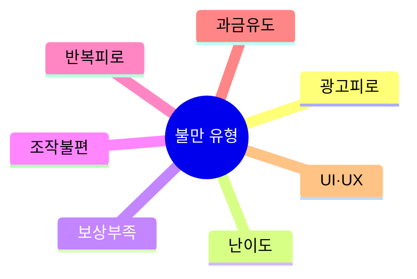
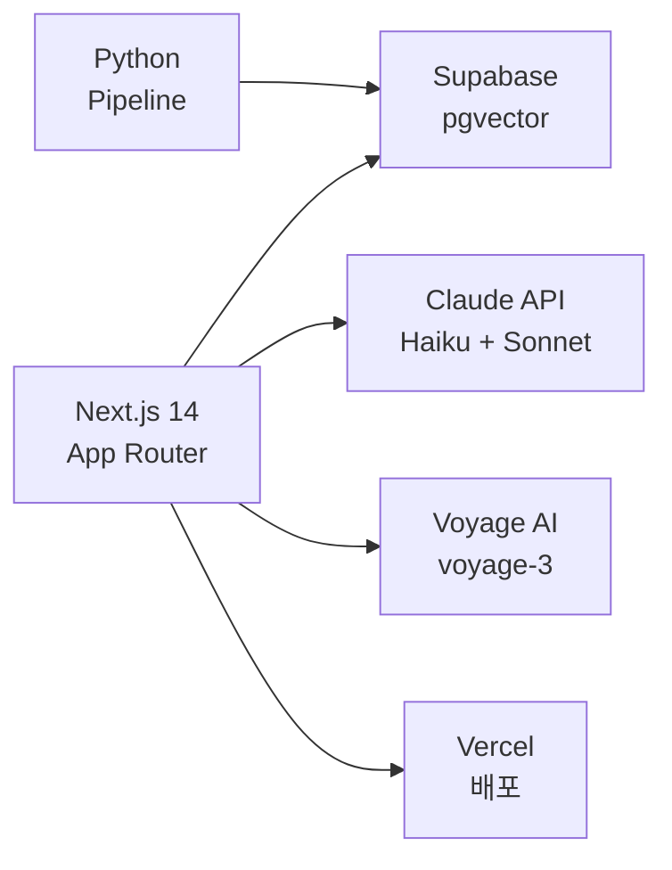

# RiskPatch 아키텍처 다이어그램

## 전체 시스템 흐름

```mermaid
flowchart TD
    subgraph PIPELINE["🗄️ 데이터 수집 파이프라인 (1회성)"]
        A[플레이스토어\n1~2점 리뷰] --> B[scraper.py\ngoogle-play-scraper]
        B --> C[preprocessor.py\nClaude Haiku\n노이즈 제거 + 불만 구조화]
        C --> D[embedder.py\nVoyage AI voyage-3\n배치 임베딩]
        D --> E[(Supabase pgvector\n1,778건 저장)]
    end

    subgraph WEB["🌐 웹 서비스 (Next.js 14)"]
        F[기획안 입력] --> G[Claude Haiku\n핵심 요소 추출\n+ 7개 검색 쿼리 생성]
        G --> H[Voyage AI\n7개 쿼리 배치 임베딩\n1회 API 호출]
        H --> I[Supabase\n7개 병렬 검색\n중복 제거 → 상위 10건]
        E -.->|코사인 유사도 검색| I
        I --> J[Claude Sonnet\n리스크 리포트 생성]
        J --> K[SSE 스트리밍\n단계별 실시간 전달]
        K --> L[리스크 리포트\n🔴🟡🟢 위험도별 출력]
    end
```

## 불만 유형 7가지

```mermaid
mindmap
  root((불만 유형))
    광고피로
    난이도
    보상부족
    조작불편
    반복피로
    과금유도
    UI·UX
```

## 기술 스택

```mermaid
flowchart LR
    A[Python\nPipeline] --> B[Supabase\npgvector]
    C[Next.js 14\nApp Router] --> B
    C --> D[Claude API\nHaiku + Sonnet]
    C --> E[Voyage AI\nvoyage-3]
    C --> F[Vercel\n배포]
```
